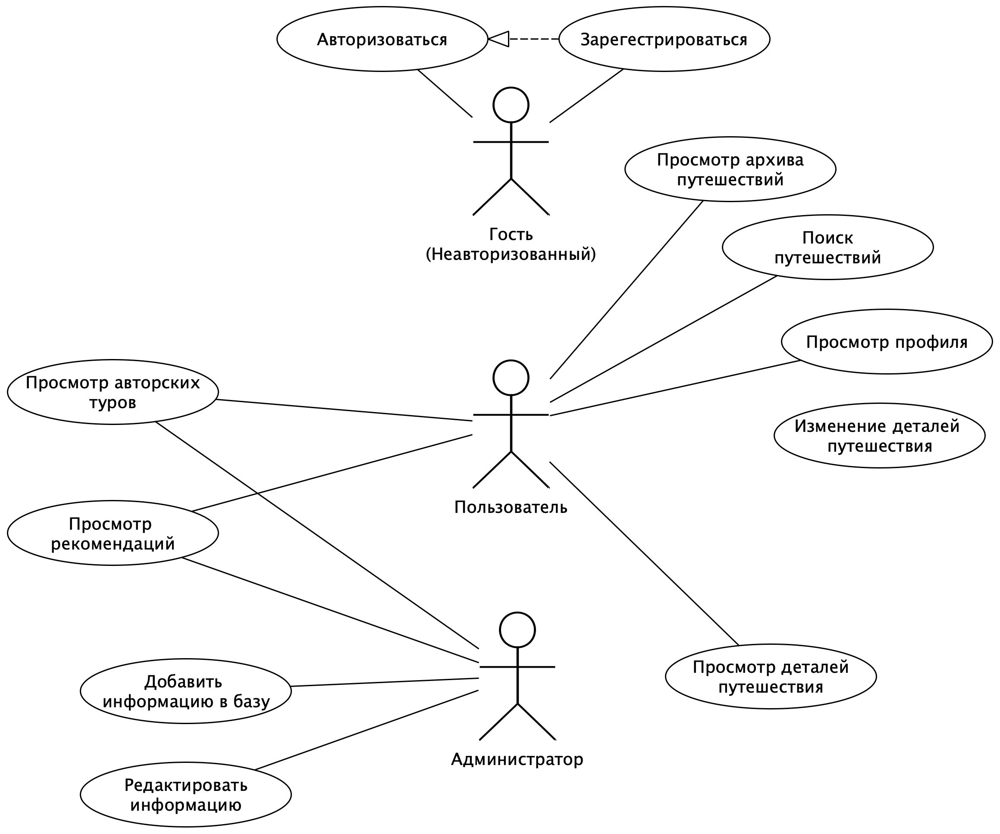
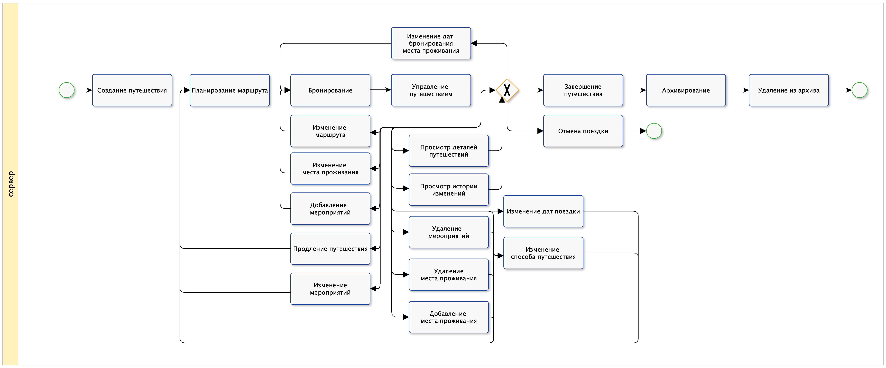
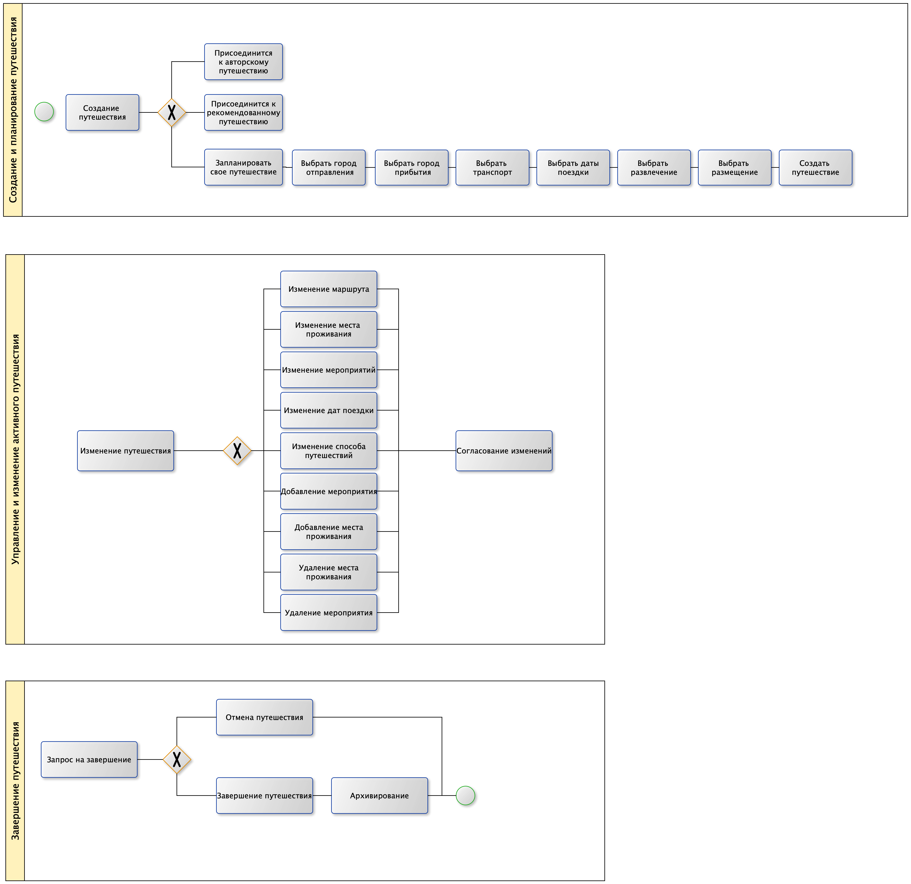
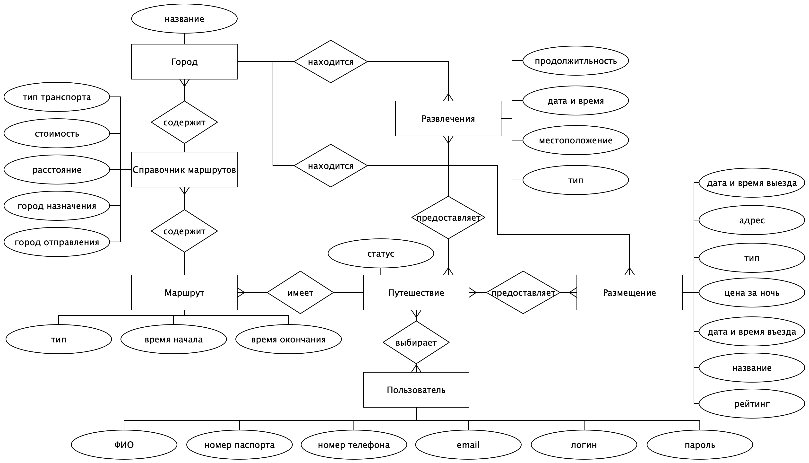
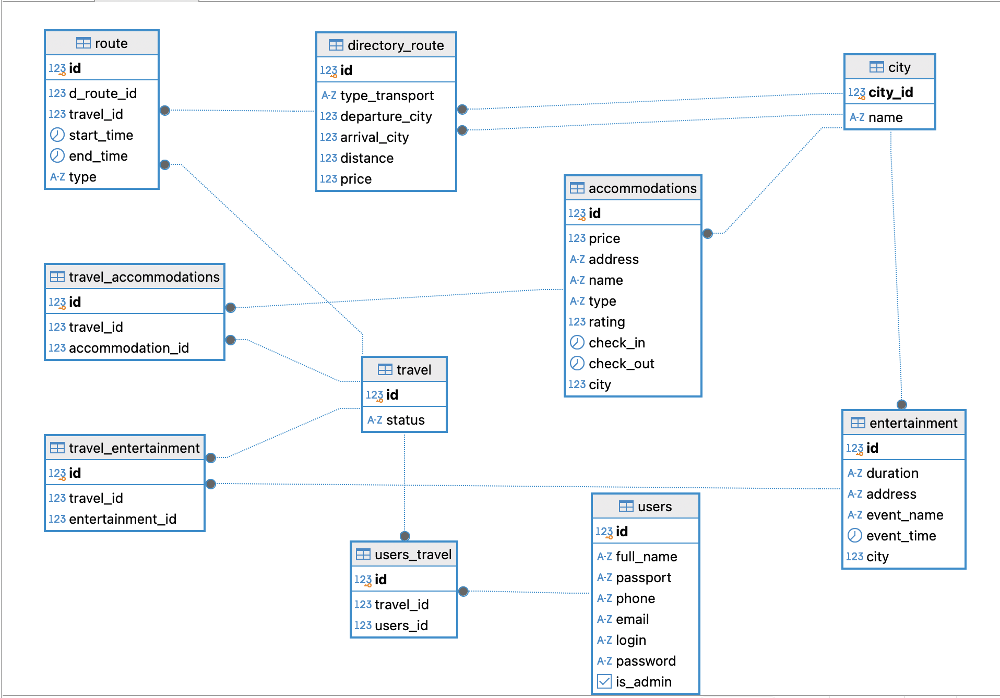
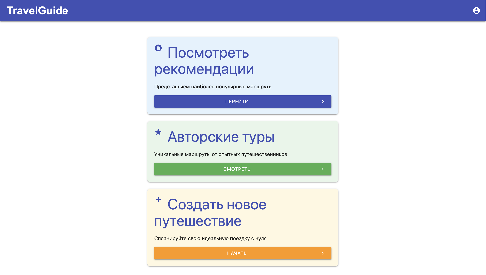
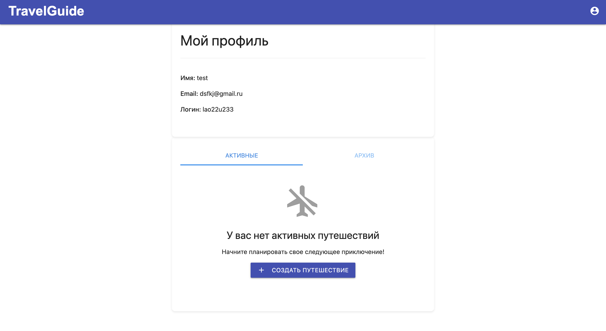
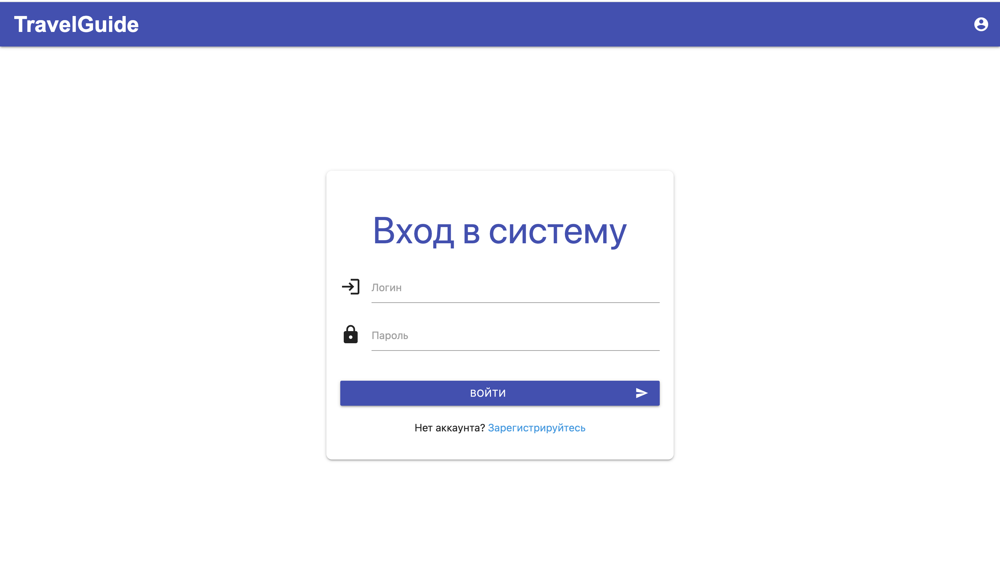
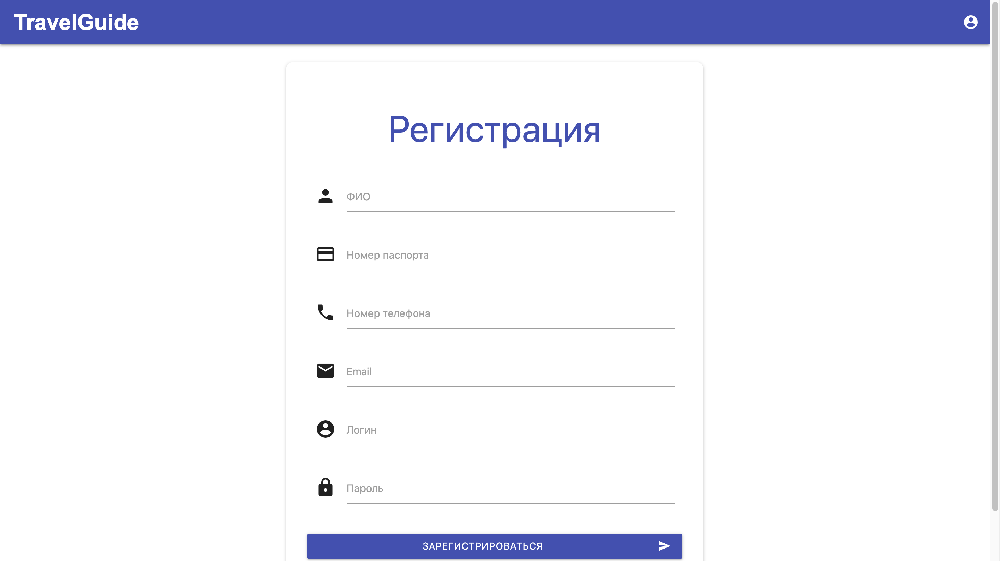

## Название проекта

Помощник путешественника.

## Цель работы
Разработка веб-приложения для планирования путешествий, позволяющего пользователям находить оптимальные варианты транспорта, проживания и развлечений с расчетом общей стоимости поездки.

## Решаемая проблема

Упрощение процесса организации путешествий путем объединения поиска транспорта, отелей и достопримечательностей в единой платформе, что экономит время пользователей и делает планирование более комфортным.

## Функциональные требования
1. регистрация и авторизация;
2. просмотр авторских и популярных маршрутов;
3. подбор возможных размещений и развлечений;
4. расчет общей стоимости путешествия;
5. просмотр архива путешествий;
6. просмотр ближайших мероприятий.

## Use-Case - диаграмма 

## Формализация ключевых бизнес-процессов

<!--  -->

## Пользовательские сценарии

1. Зайти на основую страницу.
2. Авторизоваться, зайти на страницу своего профиля.
3. Зайти на страницу регистрации, зарегестрироваться или перейти на страницу авторизации.
4. Зайти на страницу авторизации, авторизироваться или перейти на страницу регистрации.
5. Посмотреть архив путешествия.
6. Просмотреть авторские туры.
7. Посмотреть ближайшие запланированные мероприятия в текущем путешествии.
8. Поиск и фильтрация путешествий.

## ER-диаграмма сущностей 

## Технологический стек

* *Тип приложения* - Web MPA  
* *backend* - Python, FastAPI, Pydantic, SQLAlchemy
* *frontend* - Python, HTML, CSS, Jinja2Templates
* *database* - PostgreSQL  
* *Механизм доставки приложения* - Docker контейнеризация

## Диаграмма БД 

## Компонентная диаграмма системы

## Интерфейс

